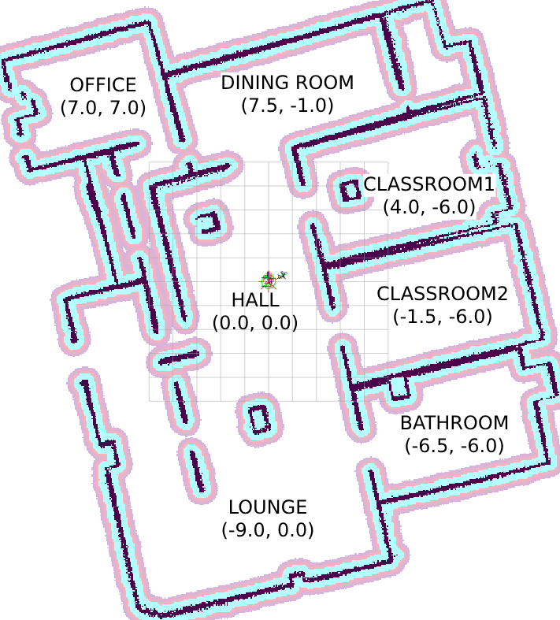

# Social Robot Lifecycle Design

Uses ROS2, Behavior Trees & LangGraph to generate a plan for a robot and the convert it to actionable steps to control the TIAGo social robot.

## Prerequisites

- ROS2 Humble ([Tutorial here](https://www.youtube.com/watch?v=0aPbWsyENA8&list=PLLSegLrePWgJudpPUof4-nVFHGkB62Izy))

- Create a ROS2 workspace

- Inside the workspace/src folder, clone this repo, then run this [script](./clone_repos.sh) to clone 4 helper repos in the src folder and to modify some files from them.

- Install [requirements](./requirements.txt)
```
pip install -r requirements.txt
```

## Configurations
Fill in your API keys in [here](./bt_node/langchain_planner.py). You can also change the OpenAI LLM model used for the agent.

You can change the person-in-room configuration and the robot memory [here](./bt_node/config.py) before you build the project. Note that you should move the person model in Gazebo as well when changing the universal truth configuration.

You can also "move" people during the simulation, as stated in the [Input section](#input).

A map containing the environment rooms:



## Running the project
Open up 3 terminals in your ROS2 workspace, and enter
```
source install/setup.bash
```
in each of them.

Build the project 
```
colcon build --packages-select bt_node 
```
---

First terminal:
```
ros2 launch tiago_gazebo tiago_gazebo.launch.py navigation:=True is_public_sim:=True [arm_type:=no-arm]
```
to open up Gazebo & Rviz

---
Second terminal:
```
ros2 run bt_node simple_person_detector 
```
to run the person detector node

---
Third terminal:
```
ros2 run bt_node controller false
ros2 run bt_node controller true
```
to run the controller. The boolean provided corresponds to the preemption functionality. If it is turned off, user feedback can be provided after every completed task.

## Input
After running the controller, you can input one of the following:
```
test
```
to build the test Behavior Tree found [here](./bt_node/behaviour_tree.py#L23) instead of one from a natural language prompt.

```
config
```
opens up a menu to relocate a chosen person to a different room. You need to also move the person mesh in Gazebo to correspond with the change. Note that **at most one person should be present in each room**.

```
#no preemtpion
Remind Alice to take her medicine

#preemption
1/Say hi to Bob
```

In case you are using preemption, the priority should be put first, separated by a '/' and then the prompt. Note that **the smaller the number, the higher the priority**.
